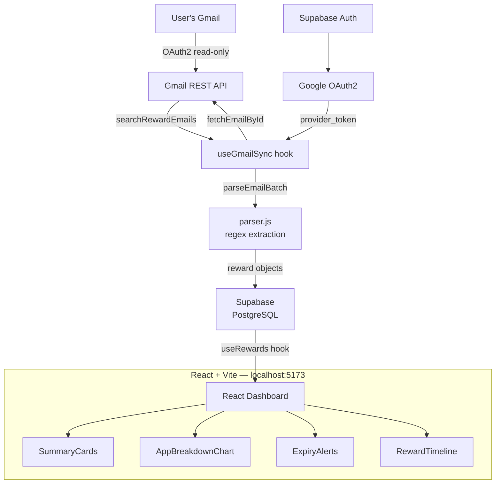

# FinPulse

**All your UPI rewards, one dashboard.**

FinPulse connects to your Gmail via OAuth2 and automatically parses cashback, coupon, refund, and points emails from Paytm, PhonePe, Google Pay, Amazon Pay, Swiggy, and Zomato — no manual entry, no missed expiry dates.


---

## Project Overview

| Feature | Details |
|---------|---------|
| Gmail parsing | Regex-based extraction of ₹ amounts, coupon codes, expiry dates |
| Supported apps | Paytm, PhonePe, Google Pay, Amazon Pay, Swiggy, Zomato |
| Reward types | Cashback, Coupon, Refund, Points |
| Auth | Google OAuth2 via Supabase (read-only Gmail scope) |
| Data | Supabase PostgreSQL — `rewards` + `sync_logs` + `profiles` |
| Demo mode | Live demo at `/dashboard?demo=true` — no sign-in required |

---

## Tech Stack

| Layer | Tech |
|-------|------|
| Frontend | React 19, Vite 8, Tailwind CSS 4 |
| Charts | Recharts (PieChart/Donut) |
| Icons | Lucide React |
| Auth | Supabase Auth (Google OAuth2) |
| Database | Supabase PostgreSQL |
| Email API | Gmail REST API v1 |
| Fonts | Syne (display), Outfit (body), JetBrains Mono (amounts) |
| Routing | React Router v7 |

---

## Architecture



**Data flow:**
1. User clicks "Sync Now" → `useGmailSync.startSync()` runs
2. Searches Gmail for reward-related keywords (`cashback`, `coupon`, `won`, etc.)
3. Fetches each email body; `parser.js` extracts amount, type, expiry, coupon code
4. Inserts into `rewards` table (deduped by `gmail_message_id` unique constraint)
5. `useRewards` refetches and updates the dashboard in real time

---

## Setup Instructions

### 1. Clone and install

```bash
git clone <repo-url>
cd rewardhub
npm install
```

### 2. Environment variables

Create `.env` in the project root:

```env
VITE_SUPABASE_URL=https://your-project.supabase.co
VITE_SUPABASE_ANON_KEY=your-anon-key
```

### 3. Supabase — run this SQL

```sql
-- Profiles (auto-created on sign-up)
create table profiles (
  id uuid references auth.users primary key,
  email text,
  full_name text,
  created_at timestamptz default now()
);

-- Rewards
create table rewards (
  id uuid primary key default gen_random_uuid(),
  user_id uuid references auth.users not null,
  gmail_message_id text not null,
  app_name text not null,
  reward_type text not null,  -- cashback | coupon | refund | points
  amount numeric,
  coupon_code text,
  email_date timestamptz not null,
  expiry_date date,
  subject_line text,
  snippet text,
  is_claimed boolean default false,
  is_expired boolean default false,
  created_at timestamptz default now(),
  unique(user_id, gmail_message_id)
);

-- Sync logs
create table sync_logs (
  id uuid primary key default gen_random_uuid(),
  user_id uuid references auth.users not null,
  status text default 'in_progress',
  emails_fetched int default 0,
  sync_completed_at timestamptz,
  created_at timestamptz default now()
);

-- Row-level security
alter table rewards    enable row level security;
alter table sync_logs  enable row level security;
alter table profiles   enable row level security;

create policy "Users see own rewards"   on rewards    for all using (auth.uid() = user_id);
create policy "Users see own sync logs" on sync_logs  for all using (auth.uid() = user_id);
create policy "Users see own profile"   on profiles   for all using (auth.uid() = id);
```

### 4. Supabase Auth — enable Google provider

In your Supabase dashboard → Authentication → Providers → Google:
- Enable Google provider
- Add your Google OAuth Client ID and Secret
- Add `http://localhost:5173` and your production URL to Redirect URLs

### 5. Run locally

```bash
npm run dev   # http://localhost:5173
```

---

## Demo

Visit `/dashboard?demo=true` to explore with 15 realistic sample rewards — no sign-in needed.

---

## Project Structure

```
src/
├── pages/
│   ├── LandingPage.jsx      # Route "/" — hero, CTAs, feature cards
│   └── Dashboard.jsx        # Route "/dashboard" — auth gate, wires all hooks
├── components/
│   ├── Layout/Navbar.jsx    # Top nav: logo, user avatar, Sync Now, sign out
│   ├── Dashboard/
│   │   ├── Dashboard.jsx        # Content area layout
│   │   ├── SummaryCards.jsx     # 3 stat cards (earned / unclaimed / expiring)
│   │   ├── AppBreakdownChart.jsx # Donut chart by app
│   │   ├── ExpiryAlerts.jsx     # Rewards expiring within 7 days
│   │   ├── RewardTimeline.jsx   # Scrollable reward list + claimed toggle
│   │   └── FilterBar.jsx        # App / type / date-range filters
│   ├── Landing/LandingPage.jsx  # Full landing page content
│   ├── Auth/LoginButton.jsx     # Google sign-in button
│   ├── UI/
│   │   ├── Toast.jsx        # Slide-in toast + ToastContainer
│   │   └── Skeleton.jsx     # SkeletonCard, SkeletonRow
│   └── LoadingStates.jsx    # Full-page skeletons + empty states + ErrorBoundary
├── hooks/
│   ├── useAuth.js           # Supabase auth state + profile upsert
│   ├── useRewards.js        # Fetch, filter, toggle-claimed
│   ├── useGmailSync.js      # Gmail search → parse → save pipeline
│   └── useToast.js          # Toast state management
├── lib/
│   ├── supabase.js          # Supabase client
│   ├── gmail.js             # Gmail REST API helpers
│   ├── parser.js            # Email regex parsing
│   └── ErrorHandler.jsx     # Error classes + legacy toast event system
├── data/
│   └── demoRewards.js       # 15 realistic demo reward entries + stat builder
└── index.css                # Design tokens (CSS vars) + Tailwind + animations
```

---

## What I Learned

- **Gmail API quirks** — Emails arrive as base64url-encoded MIME parts; decoding requires careful handling of padding and special characters.
- **Regex reliability vs. LLM parsing** — Regex patterns catch ~85% of reward emails reliably and run client-side for free; an LLM call per email would be more accurate but costs money and adds latency.
- **Supabase RLS + OAuth** — The `provider_token` from Supabase OAuth sessions gives you the third-party access token directly — no backend needed for the Gmail calls.
- **Optimistic UI for claimed toggle** — Flipping `is_claimed` in local state before the DB round-trip makes the UI feel instant; rolling back on error keeps data consistent.
- **Tailwind 4 + CSS variables** — Tailwind utility classes for layout/spacing + CSS custom properties for the design token layer is a clean combination that avoids `tailwind.config.js` bloat.
